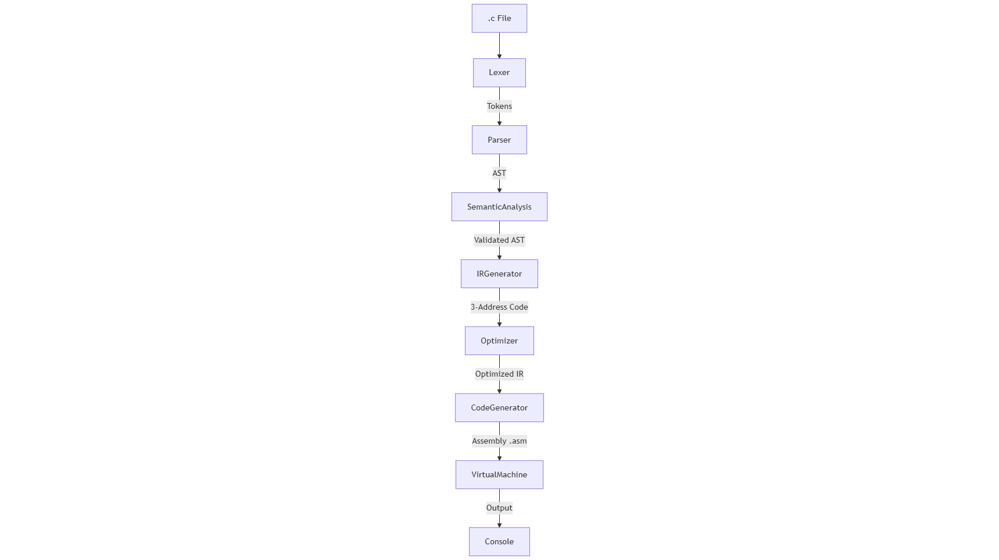

# 📘 Mini C Compiler - Technical Documentation

**Student Name:** [Your Name]
**Course:** Compiler Construction (BSCS 5th Semester)
**Project Type:** Source-to-Assembly Compiler & Virtual Machine

---

## 1. 📖 Project Overview
This project is a fully functional compiler for a subset of the **C programming language**. It does not merely "translate" code; it performs a deep analysis of the source code, validates logic, optimizes performance, and generates low-level **Custom Assembly Code** to be executed on a built-in **Virtual Machine (VM)**.

### Key Features
*   **Pipeline Architecture:** Lexical $\to$ Syntax $\to$ Semantic $\to$ IR $\to$ Optimization $\to$ CodeGen.
*   **Custom Virtual Machine:** A stack-based VM implemented in Python to execute the compiled code.
*   **Optimization Layer:** Performs **Constant Folding** and **Constant Propagation** to reduce code size.
*   **Semantic Validation:** Enforces strict type checking (e.g., prevents assigning `float` to `int`).
*   **Visualization:** Can generate Graphviz `.dot` files to visualize the Abstract Syntax Tree (AST).

---

## 2. 🏛️ System Architecture

The compiler follows the standard **Phased Compiler Architecture**:

The compiler follows the standard **Phased Compiler Architecture**:

---

## 3. 📂 Module Details

### A. Lexical Analysis (`lexer.py`)
*   **Purpose:** Converts raw text into a stream of **Tokens**.
*   **Mechanism:** Uses **Regular Expressions** to match patterns.
*   **Key Tokens:** identifiers (`x`, `fact`), keywords (`int`, `while`), operators (`+`, `==`), literals (`5`, `3.14`).
*   **Output Example:** `int x = 5;` $\to$ `[INT, ID(x), ASSIGN, NUM(5), SEMICOLON]`

### B. Syntax Analysis (`parser.py`)
*   **Purpose:** content structure validation.
*   **Mechanism:** **Recursive Descent Parser**. It assumes the structure of the code based on the current token and calls corresponding functions (e.g., `parse_if_stmt`).
*   **Output:** **Abstract Syntax Tree (AST)**. A hierarchical tree where nodes represent constructs (e.g., `BinaryOpNode`, `IfStmtNode`).

### C. Semantic Analysis (`semantic.py`)
*   **Purpose:** Logical validation and Type Safety.
*   **Mechanism:** Uses a **Visitor Pattern** to walk the AST.
*   **Core Component:** **Symbol Table** (`core/symbol_table.py`). It tracks variable names, their types, and scopes (global vs local).
*   **Checks Performed:**
    1.  **Undeclared Variables:** Using `x` before `int x`.
    2.  **Type Mismatches:** Assigning `float` to `int`.
    3.  **Function Signatures:** Calling `add(a, b)` with 3 arguments.

### D. Intermediate Representation (`ir.py`)
*   **Purpose:** Decouples the High-Level C code from the Low-Level Assembly.
*   **Format:** **Three-Address Code (TAC)**.
*   **Structure:** Simple linear instructions like `t1 = a + b`.
*   **Control Flow:** Loops and Ifs are converted into `GOTO` statements and `Labels`.

### E. Optimizer (`optimizer.py`)
*   **Purpose:** Improves code efficiency without changing logic.
*   **Techniques:**
    1.  **Constant Folding:** Detects `2 + 3` and replaces it with `5`.
    2.  **Constant Propagation:** If `x = 5`, replaces subsequent uses of `x` with `5` (until `x` changes).
    3.  **Dead Code Elimination:** Removes temporary calculations that are never used.
*   **Method:** Iterative passes until no more changes occur.

### F. Code Generation (`codegen.py`)
*   **Purpose:** Translates optimized IR into the target languages.
*   **Target:** **Custom Assembly**.
*   **Assembly Syntax:**
    *   `PUSH 5` (Push value to stack)
    *   `STORE x` (Save top of stack to variable x)
    *   `ADD` (Pop 2 values, add them, push result)
    *   `JZ Label` (Jump if top of stack is Zero)

### G. Virtual Machine (`vm.py`)
*   **Purpose:** Executes the generated assembly.
*   **Architecture:** **Stack Machine**. It does not use registers (like EAX/EBX) but relies on a data stack for all calculations.
*   **Memory:** Has `global` memory and `local` (function-scoped) memory.

---

## 4. 🗂️ File Relations & Workflow

The `main.py` file is the entry point. It imports all other modules.

1.  **Read File:** `main.py` reads `code.c`.
2.  **Lex:** Passes string to `Lexer` class $\to$ gets list of `Token`s.
3.  **Parse:** Passes tokens to `Parser` class $\to$ gets `AST` root node.
4.  **Visualize (Optional):** Passes AST to `Visualizer` to generate `.dot` file.
5.  **Analyze:** Passes AST to `SemanticAnalyzer` $\to$ validates types/scopes.
6.  **Generate IR:** Passes AST to `IRGenerator` $\to$ gets list of `IR Instruction` strings.
7.  **Optimize:** Passes IR to `Optimizer` $\to$ gets filtered list of `IR Instruction`s.
8.  **CodeGen:** Passes IR to `AssemblyCodeGenerator` $\to$ gets string of Assembly Code.
9.  **Write:** Saves result to `code.asm`.
10. **Execute:** `vm.py` loads `code.asm` and runs the instructions line-by-line.

---

## 5. 🔍 Why this Architecture?

*   **Modularity:** Each phase is in a separate file. If we want to support Java instead of C, we only change the Lexer/Parser. If we want to target Intel x86 instead of our VM, we only change the Code Generator.
*   **Educational Value:** Uses standard compiler design patterns (Recursion, Symbol Tables, TAC) that are industry standard.
*   **Robustness:** The strict semantic analysis facilitates early error detection, preventing runtime crashes.
